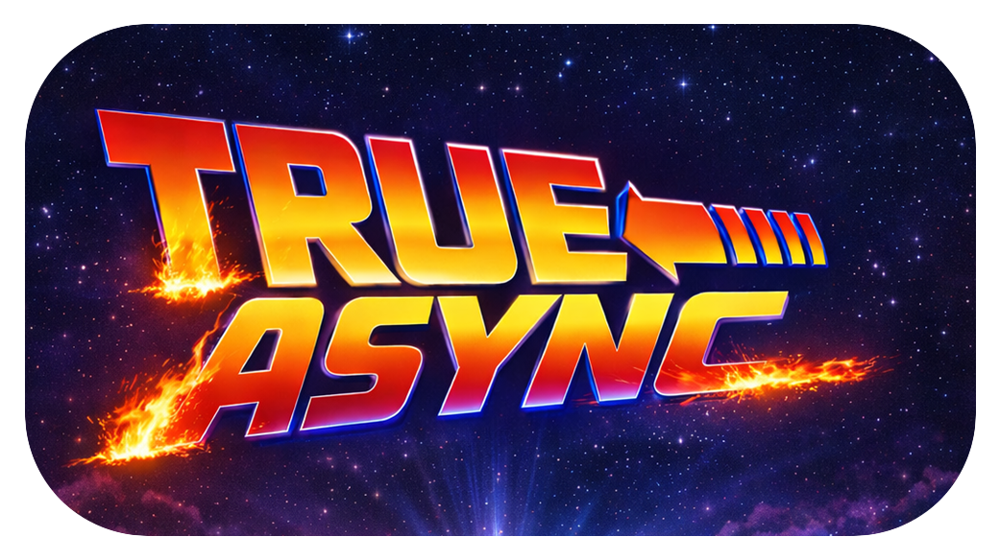

# Multithreaded PHP Explorations

An experimental space to explore future directions for multithreading in PHP, inspired by the TrueAsync RFC work. The repo hosts long-form notes, diagrams, and examples that discuss memory models, object passing, actors, and coroutine/thread interaction.

## Articles
- English: [Multithreading in PHP: Looking to the Future](mm-en.md)
- Russian: [Многопоточность в PHP: взгляд в будущее](mm-ru.md)

## What you will find
- Narrative articles describing potential PHP core changes for safe multithreading
- Diagrams of VM state, memory managers, and actor/message flows (`diagrams/`)
- Code snippets illustrating coroutine/thread patterns and actor-style APIs

## How to read
Start with the English article for the full walkthrough, then dive into diagrams alongside the sections on memory management, GC, and actors. The Russian version mirrors the same structure if you prefer to read it first.
