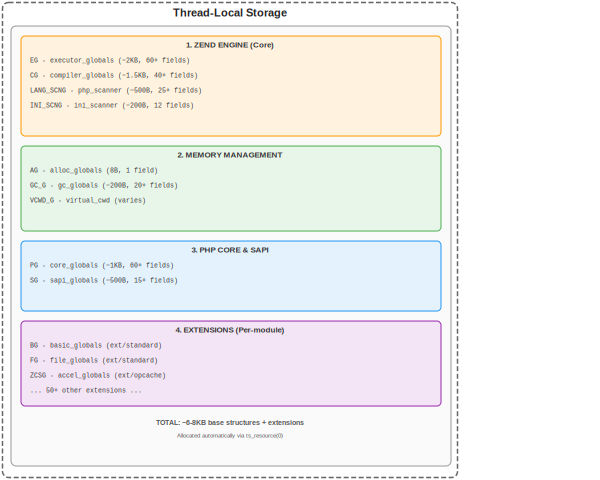
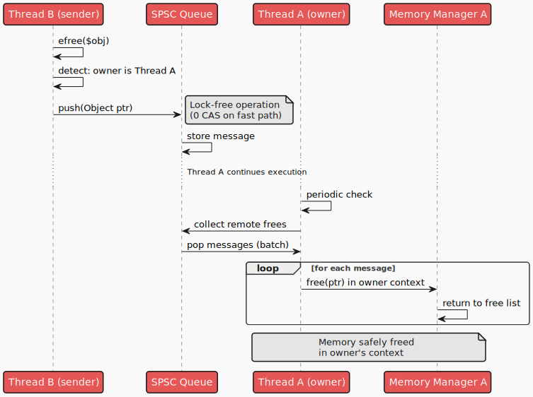
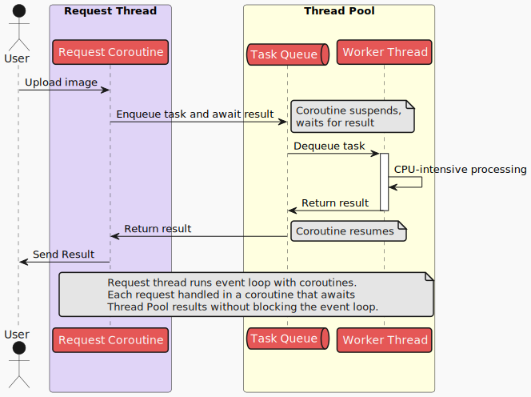
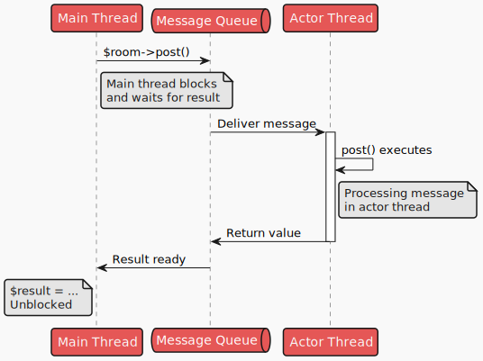

# Multithreading in PHP: Blick in die Zukunft

## Warum dieser Artikel?

Im Rahmen von [RFC TrueAsync 1.7](https://wiki.php.net/rfc/true_async) stellt sich die Frage: Wie wird der vorgeschlagene RFC mit möglichen zukünftigen Änderungen am PHP-Core zusammenspielen? Ein Gefühl dafür zu haben, wohin PHP sich entwickeln könnte, ist der Schlüssel, um den Sprachentwurf für viele Jahre gut zu halten. Deshalb gibt es diesen Artikel.

Das Projekt [TrueAsync](https://github.com/true-async/) sind nicht nur Core-Änderungen für Asynchronität, sondern auch andere Untersuchungen, um Fragen zu beantworten wie:

* Wie weit kann PHP in Richtung Multithreading gehen?
* Gibt es grundlegende Grenzen?
* Welche Core-Änderungen wären nötig, um Multithreading Wirklichkeit werden zu lassen?
* Welche Sprachabstraktionen ließen sich implementieren?

Ich habe nicht versucht, alle Aspekte von Multithreading in PHP vollständig zu behandeln oder jeden technischen Punkt perfekt und allgemeinverständlich zu machen. Dennoch hoffe ich, dass der Text für viele PHP-Entwickler nützlich ist und eine Richtung für weitere Diskussionen vorgibt.

## Geschichte

Als wir vor einigen Jahren große Telemetriemengen in eine PHP-Anwendung einbauen mussten, sagte ich: unmöglich. Nach einem Blick auf die `Swoole`-Architektur wollte ich die Behauptung testen. Können wir ein API bauen, das viele Daten erzeugt und verarbeitet, ohne den Client auszubremsen?

Wir haben eine optimierte Version von `OpenTelemetry` für PHP gebaut: Daten wurden in Teilen geschrieben, zu großen Blöcken zusammengefasst und an einen Telemetrie-Zwischenserver geschickt. Es wurde komprimiert, `JSON`-Strukturen wurden mit `MessagePack` serialisiert.

Die Hauptannahme: Mit Single-Thread-Coroutines können wir Telemetrie schrittweise aufbauen und periodisch zum Server schicken, per Timer oder bei Erreichen einer Größenschwelle. Der Code sollte schnell sein, weil es keine Thread-Interaktion gibt. Stimmt das?

Das Experiment zeigte: Telemetrie halbierte den API-Durchsatz. Hypothese gescheitert. Aber warum? Auf _konzeptioneller_ Ebene wirkte alles logisch. `Swoole` machte PHP-Funktionen bereits nicht blockierend, also sollten Coroutines effizient sein. Irgendwo lag der Fehler.

In Version zwei wurde Telemetrie nur während einer Anfrage gesammelt und sofort in einen Job-Prozess gegeben, der aggregierte, komprimierte und an den Server sendete. Das lief deutlich besser. Aber so sollte es doch nicht sein! Oder doch? Daten wurden per `pipe` zwischen Prozessen übertragen, auf einer Seite serialisiert, auf der anderen deserialisiert. Selbst wenn die Pipe im Speicher liegt, sind OS-Aufrufe teuer.

Später fanden wir den Grund: Sehr viel Telemetrie, Kompression fraß viel CPU-Zeit im Vergleich zum API-Handling. `Swoole`-Coroutines waren zwar effizient für I/O, halfen aber nicht bei CPU-intensiven Aufgaben.

Dieser Fall ist einer von vielen, die zeigen: Single-Thread-Coroutines lösen nicht alles. Multithreading kann sie ergänzen und ein Werkzeugset für viele Aufgaben bilden.

## Single-threaded + offload

CPU-intensive Arbeit in einen separaten Prozess auszulagern, ist kein „neuer“ Trick. Es gehört zu einem Modell, das in verschiedenen Sprachen/Frameworks unabhängig entstand: **Single-threaded + offload**.

Stell dir eine Person vor, die blitzschnell Briefe sortiert (tausende pro Stunde), während andere schwere Pakete verladen und fahren. Wenn der Sortierer Pakete trägt, wächst der Briefstapel bis zur Decke.

Das Modell `Single-threaded + offload` trennt Aufgaben in zwei Typen:

1. **I/O-bound Aufgaben** — Dateien lesen, Netzwerkanfragen, DB-Zugriffe. Meist wartet der Prozess auf die Außenwelt. Tausende solcher Operationen passen in einen Thread via konkurrierendes Async (`Coroutines`, `await`).

2. **CPU-bound Aufgaben** — Kompression, Verschlüsselung, Parsing, Berechnungen. Hier läuft die CPU auf Volllast, bloße Konkurrenz hilft nicht; man braucht mehr Kerne.

Das Modell trennt diese Aufgaben **physisch**: Der Hauptthread (`Event Loop`) macht nur `I/O`, `CPU`-Aufgaben gehen an separate Threads/Prozesse (`Workers`).

**Node.js** war für seinen Single-Thread-`Event Loop` bekannt, ideal für Netzwerkanwendungen. Bei Bild- oder Videokompression im Request-Handler wurde der Server aber zur Kürbis. Die Lösung: `Worker Threads`, separate Threads für CPU-intensive Operationen.

**Python** ging ähnlich. Mit `asyncio` bekam die Sprache ein starkes Werkzeug für I/O-bound-Code, aber der eingebaute GIL (Global Interpreter Lock) verhinderte echten CPU-Parallelismus im Prozess (zum Zeitpunkt des Schreibens bereits adressiert). Für blockierende Operationen kamen `loop.run_in_executor()` und `asyncio.to_thread()` (ab Python 3.9), die schwere Arbeit an Thread- oder Process-Pools auslagern. Der Event Loop bleibt reaktionsfähig, die Berechnung läuft parallel.

**PHP/Swoole** folgt derselben Architektur: `Request Workers` bearbeiten HTTP-Anfragen mit Coroutines, `Task Workers` übernehmen schwere Berechnungen. Über `UnixSocket` oder `pipe` lassen sich ~100k Operationen pro Sekunde pro Prozess abwickeln.

### Vorteile des Modells

**1. Ressourceneffizienz**

Ein Single-Thread-Event-Loop bedient tausende gleichzeitige I/O-Operationen mit minimalem Overhead. Kontextwechsel zwischen Coroutines sind günstiger als OS-Thread-Context-Switches. `CPU-bound`-Aufgaben bekommen echten Parallelismus auf mehreren Kernen – jeder Worker nutzt seinen Kern ohne andere zu stören.

**2. Einfachere Entwicklung**

Im Event-Loop-Code braucht es keine Mutexes, Semaphoren und andere „Freuden“ des Multithreadings. Im Single-Thread-Modell läuft genau eine Aufgabe gleichzeitig, **Race Conditions** sind ausgeschlossen. `Workers` laufen parallel, aber mit `Shared Nothing` entstehen keine Sync-Probleme.

Der Komplexitätsunterschied zwischen Multithread-Code und Single-Thread-Async ist riesig. Kein Wunder, dass moderne Sprachen/Frameworks auf Single-Thread-Async statt klassischem Multithreading setzen.

**3. Einfacherer Compiler/Runtime**

Async-Funktionen sind im Single-Thread-Modell viel simpler für Compiler und Runtime. Eine gute Multithread-Sprache braucht eine eigene Codegen-Pipeline. PHP hat eine harte Einschränkung: Teile sind in C geschrieben. Das verhindert effiziente Bytecode-Optimierungen, Speicherverwaltung und Parameterübergabe für Multithreading. Dass Go komplex ist – proprietärer Stack, komplexer GC – dient den Goroutines und Channels. Zum PHP-GC kommen wir noch.

**4. Manuelle Lastverteilung**

Entwickler können bewusst zwischen Request-Logik und Worker-Pool-Code trennen. Manuelle Steuerung erlaubt maximale Hardwareauslastung. Gleichzeitig ist das ein Nachteil.

### Nachteile des Modells

**1. Manuelle Lastverteilung**

Doppelschneidig: Ein Entwickler kann optimieren oder falsch einschätzen, was ins I/O und was zu `Workers` gehört. I/O-Code kann mit schweren Jobs überladen werden, was Antwortzeiten verschlechtert.

Das Modell erfordert genügend Können bei PHP-Entwicklern oder Vertrauen in Framework-Autoren und ihre Lösungen.

**2. Nicht für jede Aufgabe**

`Single-threaded + offload` ist super für Webserver, APIs, Microservices, wo die Hauptlast I/O mit DB/FS/Netz ist. Bei rechenintensiven Schritten – wissenschaftliches Rechnen, Rendering, ML – kann es ineffizient sein; volles Multithreading passt besser.

Vielleicht sagst du: Damit können wir leben! Wir sind bereit! Aber ist PHP bereit, multithreaded zu werden?

## Ist PHP bereit für Multithreading?

Während `TrueAsync` war eine der härtesten Diskussionen: „Warum hat PHP keine Async?“. Zu erklären, warum PHP nicht multithread-ready ist, könnte ähnlich schwierig sein. Zuerst: Wozu brauchen wir Multithreading – oder besser: wozu **nicht**?

> Multithreading wird nicht für parallele Codeausführung gebraucht.

Die Idee, dass Multithreading für Parallelität nötig ist, sitzt seit langem in den Köpfen, wie die Idee, dass schwarze Löcher „alles einsaugen“, im Popkultur-Bild.

Parallelität können Prozesse gut, isoliert voneinander (seit 80386). Prozesse kommunizieren über `IPC`, ihre Beendigung wird über Signale verfolgt. Warum also Threads?

Um ehrlich zu antworten, müsste man die damaligen Entscheider fragen: Edsger Dijkstra, Fernando Corbató, Barbara Liskov, Richard Rashid – ein tolles Talkshow-Line-up. Selbst dann gäbe es vielleicht keine klare Antwort.

Falsch wäre zu behaupten:

> Threads sind da, damit paralleler Code ohne Zusatztools Speicher teilen kann.

Prozesse können ebenfalls Speicher teilen, brauchen dafür aber ein gemapptes Segment (Zusatztool). Threads teilen **den gesamten** Speicher per Default. Wörtlich: Ist eine Variable `x` in Thread `A` erreichbar, dann auch in `B` an derselben Adresse ohne Tricks... Aber nein: Mehrere Threads **können** nicht ohne Extras auf dieselbe Variable zugreifen.

Ehrlicher wäre:

> Threads dienen dazu, Speicher zwischen Aufgaben ohne Zusatzkosten zu übergeben.

Nutzen Threads Speicher für Nachrichten und hat jeweils nur ein Thread Zugriff auf einen Bereich, ist das maximal effizient in Speicher und CPU. Threads vermeiden bewusst Bereiche, die gemeinsam wären. Dieses Modell heißt `Shared Nothing`.

Threads braucht man, um Daten effizient zwischen Aufgaben zu übertragen. So wahr wie „schwarze Löcher saugen nicht“.

## PHP-Speichermodell

Wie geht PHP mit Speicher um? Vereinfachtes, abstraktes Modell:
1. Code
2. Daten
3. Zustand der PHP-VM

Code zwischen Threads zu teilen, geht bereits (gelöst mit PHP JIT). Die restlichen Komponenten sind stark gekoppelt und nicht leicht zu trennen. PHP hat einen globalen `object_store` für alle erzeugten Objekte. Der Memory Manager ist für eine einzige PHP-VM gebaut, nicht für Multithreading. Der **Garbage Collector** kann nicht mit Daten aus verschiedenen Threads arbeiten und erfordert sogar einen Stop der VM, weil er direkt `refcount` ändert.

PHP ist also strikt Single-Thread mit Stop-the-World-GC.

### PHP-VM zwischen Threads bewegen

PHP nutzt **Thread-Local Storage (TLS)**, um den VM-Zustand pro Thread zu speichern. Das ist entscheidend für Isolation im ZTS-Modus (Zend Thread Safety).

In modernen Builds wird eine „statische“ Variable nach C11 `__thread` (oder `__declspec(thread)` in MSVC) genutzt, um den VM-Zeiger zu holen. Sehr schnell; auf `x86_64` ist es ein Lesen einer Adresse relativ zu `FS` oder `GS`.

```asm
      ; offset - konstanter Offset, Compile-Time berechnet
      ; fs - Basisadresse des Segments
      mov rax, QWORD PTR fs:offset
```

Da `FS/GS` pro Thread einzigartig ist (vom OS gewährleistet), liefert das Lesen immer den richtigen VM-Zeiger.

Den VM-Zustand zwischen Threads zu verschieben, kann für Go-ähnliche Coroutines oder Actoren nützlich sein. Moderne VMs übertragen Kontext via angepasstem Codegen mit CPU-Registern. In PHP geht das nicht, weil darunter C-Funktionen liegen und C keinen impliziten Kontextparameter kennt. Das Verschieben des VM-Zustands kostet also Performance.

Was, wenn wir nur den kleinen Teil des VM-Zustands bewegen, der zum Ausführen nötig ist? `PHP Fiber` kopiert z. B. einige Zeiger auf globale Strukturen (`zend_executor_globals`) beim Wechsel.

Stelle dir vor, die VM in zwei große Teile zu teilen:
1. `PHP VM` shared: Klassen, Funktionen, Konstanten, ini-Direktiven, ausführbarer Code.
2. `PHP VM` movable: der Teil, der beweglich sein muss.



Manche Strukturen könnten `shared` sein, andere `movable`; selbst `Executor Globals` ließen sich teilen, um effiziente VM-Verschiebung zu ermöglichen. Globale Strukturen von Extensions verlieren keine Performance durch extra Indirektion, sie nutzen sie schon.

Problematisch sind Strukturen rund um Code-Compilation, da PHP dynamisch ist (`include/require`, `eval`, Autoload). Diese Eigenschaften erschweren eine effiziente Trennung in shared/movable. Wird das gelöst, könnte PHP Teile des VM-Zustands mit minimalem Overhead zwischen Threads bewegen.

## Objekte zwischen Threads übertragen

Was muss sich ändern, damit PHP Objekte problemlos zwischen Threads übergeben kann? Wie könnte das funktionieren?

Betrachten wir es auf Sprachebene. Wir haben ein `SomeObject` in `$obj` und wollen es an einen anderen Thread schicken. Geht das?

```php
$obj = new SomeObject();

$thread = new Thread(function () use ($obj) {
    echo $obj->someMethod();
});

$thread->join();
```

Da `SomeObject` nur `$obj` gehört, könnten wir seine Adresse sicher in einen anderen Thread verschieben. `$obj` im Hauptthread würde zerstört:

```php
$obj = new SomeObject();

$thread = new Thread(function () use ($obj) {
    echo $obj->someMethod();
});

// $obj is undefined here

$thread->join();
```

Der Code entspricht Move-Semantik aus C++/Rust. So Speicher zu übergeben, bietet:
1. Sicherheit: nur ein Thread besitzt das Objekt.
2. Kein Kopier- oder Serialisierungs-Overhead.

Für Vorhersehbarkeit und statische Analyse könnte man spezielle Syntax hinzufügen, z. B.:

```php
$obj = new SomeObject();

// consume $obj signalisiert Verschiebung
$thread = new Thread(function () use (consume $obj) {
    echo $obj->someMethod();
});

// $obj is undefined here. Error should be reported here in PHP9.
echo $obj;
```

Sieht toll aus, oder?

Doch das Verschieben mit `refcount = 1` hat Probleme. Beispiel Kategoriembaum:

```php
$electronics = new CategoryNode('Electronics');

$categoriesTree = new Tree();
$categoriesTree->addToPath('/products/electronics', $electronics);
$categoriesTree->addToPath('/popular/electronics', $electronics);  // gleiche Kategorie!
```

`$electronics` steht zweimal im Baum (`refcount = 2`). Was passiert beim Verschieben von `$categoriesTree` in einen anderen Thread?

Für sicheres Verschieben muss garantiert sein, dass alle Objekte im Graph keine externen Referenzen haben:

```php
$node = new CategoryNode('Electronics');
$categoriesTree = new Tree();
$categoriesTree->addToPath('/products/electronics', $node);

$favourites = [$node];  // externe Referenz!

$thread = new Thread(function () use ($categoriesTree) {
    // $categoriesTree verschoben
});

// $favourites[0] zeigt jetzt auf Speicher eines anderen Threads
// Dangling pointer!
```

Für garantiert sicheres Verschieben bräuchte es:

1. **Vollständige Graph-Traversierung** – alle verschachtelten Objekte prüfen.
2. **Refcount-Prüfung** – für jedes Objekt.
3. **Identität erhalten** – Duplikate im Graph bleiben Duplikate.

Dafür lassen sich Algorithmen entwerfen, nennen wir es `deep copy`. Eine einfache Umsetzung:

```php
// Deep copy Pseudocode
// Quellgraph in Thread A
$node = new Node('A');        // addr: 0x1000
$tree->left = $node;          // addr: 0x1000
$tree->right = $node;         // addr: 0x1000 (gleiche Referenz)

// Kopie in Thread B (mit MM Pseudocode)
$copied_map = [];  // Hash: addr_source -> addr_target

function deepCopyToThread(object $obj, Thread $target_thread_mm) 
{
    $source_addr = get_object_address($obj);

    if (isset($copied_map[$source_addr])) {
        return $copied_map[$source_addr];  // schon kopiert
    }

    // Speicher im MM des anderen Threads allozieren
    $new_addr = $target_thread_mm->allocate(sizeof($obj));
    $copied_map[$source_addr] = $new_addr;

    // Objektdaten kopieren
    memcpy($new_addr, $source_addr, sizeof($obj));

    // Eigenschaften traversieren
    foreach ($obj->properties as $prop) {
        if (is_object($prop)) {
            $new_prop_addr = deepCopyToThread($prop, $target_thread_mm);
            // Zeiger im neuen Objekt aktualisieren
            update_property($new_addr, $prop, $new_prop_addr);
        }
    }

    return $new_addr;
}

// Ergebnis in Thread B:
// $newTree->left (addr: 0x2500) === $newTree->right (addr: 0x2500)
// Identität erhalten!
```

**Zeitkomplexität Deep Copy**: `O(N + E)`, `N` Objekte, `E` Referenzen.
**Speicherkomplexität**: `O(N)` — Hash + neue Objekte + Rekursionsstack.

Im Vergleich zur Serialisierung kann es schneller sein, weil kein Formatwechsel nötig ist, aber der Gewinn hängt von Datenform und Graphgröße ab. Man kann auch hybrid vorgehen: `refcount = 1` verschieben, den Rest `deep copy`.

Ergebnis:
1. PHP-Entwickler müssen nicht überlegen, wie Objekte übergeben werden.
2. Best Case: Speicher wird verschoben (`refcount = 1`).
3. Worst Case: Speicher wird kopiert, Identität bleibt (`refcount > 1`).

Klingt gut:
* minimale PHP-Syntax-Änderungen
* Änderungen können schrittweise erfolgen
* Multithreading wird verfügbar

Auf Core-Ebene ist es jedoch nicht so rosig. Damit das Verschieben real wird, braucht PHP ein Speicherverwaltungs-Mechanismus über Threads hinweg. Aktuell nicht möglich.

## Multithreaded PHP Memory Manager

Der PHP-Memory-Manager ähnelt modernen Allocatoren wie `jemalloc` oder `tcmalloc`. Unterschied: Er hat keinen korrekten Algorithmus zum Freigeben aus einem anderen Thread.

Betrachte:
* Objekt in Thread `A` erstellt.
* Per Move an Thread `B` gegeben.
* In `B` nicht mehr gebraucht, soll frei werden.

Jeder PHP-Thread hat seinen eigenen `Memory Manager (MM)`. Versucht `B`, Speicher zu freigeben, den `A` alloziert hat, gibt es ein Problem. `B`'s MM kennt `A`'s Speicher nicht, freigeben wäre fehlerhaft. Direktzugriff auf `A`'s MM aus `B` ist schlecht (braucht Sync). Moderne, performante Multithread-Allocator lösen mit `deferred free`.

Grundidee `deferred free`:
1. MM von `B` sieht unbekannten Zeiger.
2. Er findet den zuständigen MM und schickt eine Nachricht in dessen Warteschlange, dass der Zeiger frei ist.
3. MM von `A` verarbeitet die Queue und gibt in seinem Kontext frei.



Mit lock-freien Strukturen hat dieses Verfahren hohen Durchsatz, ermöglicht paralleles Freigeben und braucht fast keine Locks.

Ein multithreaded Memory Manager für PHP öffnet Türen für andere, bisher unmögliche Änderungen.

## Shared Objects

Speicher mit minimalen Operationen zwischen Threads zu übertragen, ist gut. Was, wenn wir Objekte direkt so bauen könnten, dass sie zwischen Threads geteilt werden?

Viele Services können als immutable Objekte gebaut werden und sollten ehrlich zwischen Prozessen geteilt werden, um Speicher zu sparen und Worker schneller zu starten.

Leider steht `refcount` im Weg, da es alle PHP-Objekte faktisch mutabel macht. Kann man das umgehen?

### Proxy Objects

Ein Ansatz: Proxy-Objekte, die auf reale Objekte in einem gemeinsamen Speicherpool verweisen. Die Proxys enthalten nur eine ID oder einen Zeiger und Methoden zum Zugriff. Nachteile:
* längere Zugriffszeiten auf Daten/Eigenschaften
* höhere Komplexität für `Reflection API` und Typberechnung

Andererseits hat PHP bereits starke Proxy-Mechanismen. In manchen Fällen sind Proxy-shared-Objekte ideal, z. B. für Zählertabellen oder Swoole/Table-ähnliche Datentabellen.

### Shared Objects mit GC_SHARE-Flag

PHP hat `GC_IMMUTABLE` für **immutable** Elemente, genutzt für:

- **Interned Strings** (`IS_STR_INTERNED`) — String-Konstanten für den gesamten Prozess.
- **Immutable Arrays** (`IS_ARRAY_IMMUTABLE`) — z. B. `zend_empty_array`.
- **Konstanten im opcache** — kompiliertes Code mit konstanten Daten.

`GC_IMMUTABLE` lässt den Engine **Refcount-Änderungen überspringen**:

```c
// Zend/zend_types.h
// Funktion zum Erhöhen des Refcount
static zend_always_inline void zend_gc_try_addref(zend_refcounted_h *p) {
    if (!(p->u.type_info & GC_IMMUTABLE)) {
        ZEND_RC_MOD_CHECK(p);
        ++p->refcount;
    }
}
```

Ähnliches könnte `SharedObjects` unterstützen, etwa ein `GC_SHARE`-Flag.

Performance-Analyse zeigt: Die Prüfung von `GC_SHARE` fügt **+34% Overhead** zu einem isolierten `refcount++` hinzu (Mikrobenchmark). In realen Apps, wo Refcount-Arbeit nur ein kleiner Anteil ist, dürfte der Effekt minimal sein:

- **Realistische Operationen** (Arrays/Objekte): +3-9%
- **Reale Anwendungen**: +0.05-0.5%

Das löst die halbe Aufgabe; die andere ist ein GC für solche Objekte. Atomischer Refcount ist nicht ideal wegen möglicher Verlangsamung bei starkem Zugriff vieler Threads. Wahrscheinlich passt `deferred free` besser.

### Region-based Memory

Region-basierte Speicherverwaltung ist in Web-orientierten Sprachen beliebt.

Idee: Speicher für eine Aufgabe oder Thread in separaten Regionen alloziieren, die (fast) komplett freigegeben werden können, wenn sie nicht mehr gebraucht werden. Das vermeidet Objekt-für-Objekt-Verwaltung und vereinfacht den GC.

`PHP MM` könnte z. B. garantieren, dass Objekte in einer Region erstellt werden, die an ein PHP-Objekt gebunden ist. Die Lebensdauer der Region entspricht der des Objekts.

Wenn das Objekt zerstört wird, kann die Region ohne Traversierung freigegeben werden. Muss das Objekt in einen anderen Thread „verschoben“ werden, kann man auf Deep Copy verzichten.

Die PHP-VM hat Probleme bei region-based Memory — globale Objektliste, Opcode-Cache. Aber eine effiziente Umsetzung ist nicht ausgeschlossen und verdient weitere Forschung.

Ein funktionierender Region-Algorithmus eröffnet Möglichkeiten zur Implementierung von Actoren, speziellen Objekten mit isoliertem Speicher.

Actoren sind das bequemste, mächtigste und sicherste Werkzeug für Multithreading.

## Coroutines und Threads

Aus Sicht einer Coroutine ist `Thread` ein `Awaitable`-Objekt. Eine Coroutine kann auf das Ergebnis eines `Thread` warten, ohne andere Coroutines zu blockieren. Ein Thread kann also viele Coroutines beherbergen, die auf schwere Aufgaben warten. Der Thread, der sie bedient, bleibt reaktionsfähig, weil `await` auf `Thread` den Event Loop nicht blockiert.

```php
use Async\await;
use Async\Thread;

$thread = new Thread(function() {
    // hardwaregebundene Aufgabe
    return 42;
});

$result = await($thread); // Coroutine pausiert hier, bis der Thread fertig ist
```

Damit lässt sich ein Chat-Szenario mit CPU-intensiven Aufgaben und einfacher Geschäftslogik bauen.



Das Diagramm zeigt eine Beispielarchitektur. Zwei Thread-Pools: Request-Threads mit konkurrierender Multitasking, Worker-Threads für CPU-intensive Aufgaben. Eine Coroutine bearbeitet eine Anfrage, kann komplett pausieren, bis ein Worker fertig ist, und dann fortfahren.

```php
use Async\await;
use Async\ThreadPool;

final readonly class ImageDto
{
    public function __construct(
    public int $width,
    public int $height,
    public string $text,
) {}
}

$pool = new ThreadPool(2);
$dto = new ImageDto(
    width: 200,
    height: 200,
    text: 'Hello TrueAsync!'
);

$image = $pool->enqueue(function (ImageDto $dto) {
    $img = imagecreatetruecolor($dto->width, $dto->height);

    $white = imagecolorallocate($img, 255, 255, 255);
    $black = imagecolorallocate($img, 0, 0, 0);

    imagefill($img, 0, 0, $white);
    imagestring($img, 5, 20, 90, $dto->text, $black);

    ob_start();
    imagepng($img);
    imagedestroy($img);
    return ob_get_clean();
}, $dto);

$response->setHeader('Content-Type', 'image/png');
$response->write($image);
$response->end();
```

Coroutine-Code ist sequentiell und liest sich, als würde `ThreadPool::enqueue` den Callback im selben Thread ausführen. Das DTO wechselt Threads, der resultierende String wird nicht doppelt kopiert.

## Garbage Collector und stateful Modus

Die Modernisierung des Memory Managers ist nicht die einzige nötige Änderung. Ohne effizienten GC wird Multithread-PHP unter Performanceproblemen und Leaks durch Zyklen leiden.

Der PHP-GC nutzt zwei Algorithmen: **Reference Counting** als Primärmechanismus und **Concurrent Cycle Collection** (Bacon-Rajan, 2001) für Zyklen. Reference Counting erhöht/verringert bei jeder Zuweisung – in Multithreading ohne Sync unsicher. Atomics überall hätten riesigen Overhead; ohne Sync gäbe es Races und Leaks. Der Cycle Collector, obwohl „concurrent“ genannt, arbeitet nur in einem Thread und nutzt Farbmarkierung (**PURPLE** → **GREY** → **WHITE/BLACK**) – auch nicht thread-safe.

Positiv: Die aktuelle GC-Implementierung funktioniert in multithreaded Umgebungen, da sie vom Memory Manager getrennt ist und nicht vom Allokationsort abhängt.

Will PHP eine multithreaded, stateful Ära, muss der GC angepasst werden, um:
1. **Parallel** in einem separaten Thread zu laufen, ohne Business-Code zu stören.
2. Ressourcen so schnell wie möglich freizugeben.
3. Zusatztools für Leak-Detection, Logging, Telemetrie zu bieten (besonders für Langläufer).

Der Cycle Collector kann modifiziert werden, um Referenzen in einem separaten Thread zu verarbeiten, was die Reaktionsfähigkeit verbessert. Für den Anfang kann das reichen.

## Actoren

`ThreadPool` und Objekte zwischen Threads zu übergeben, ist nützlich, erfordert aber Aufmerksamkeit, Können und Aufwand. Es gibt eine bessere Abstraktion, die Thread-/Speicherkomplexität verbirgt und perfekt zur Businesslogik passt: **Actoren**.

Actoren sind ein Modell konkurrierender/paralleler Programmierung, bei dem die Basiseinheit der **Actor** ist.

Jeder Actor:
- Hat eigenen isolierten Zustand
- Verarbeitet Nachrichten sequentiell
- Interagiert mit anderen Actoren nur über Nachrichten
- Kann in einem separaten Thread laufen

Man kann Actoren wie Objekte sehen und so OOP-Paradigmen im multithreaded PHP nutzen.

Stell dir einen Chat-Server mit vielen Räumen vor. Jeder Raum ist ein Objekt.

```php
use Async\Actor;

class ChatRoom extends Actor
{
    private array $messages = [];
    private string $name;

    public function __construct(string $name)
    {
        $this->name = $name;
    }

    public function postMessage(string $user, string $text): void
    {
        $this->messages[] = [
            'user' => $user,
            'text' => $text,
            'time' => time()
        ];
    }

    public function getMessages(): array
    {
        return $this->messages;
    }
}

spawn(function() {
   $room = new ChatRoom('general');
   $room->postMessage('Alice', 'Hello!');  // Läuft in anderem Thread, suspendiert Coroutine
   $messages = $room->getMessages();       // Läuft in anderem Thread, suspendiert Coroutine
   echo json_encode($messages);
});
```

`ChatRoom`-Objekte sind speziell: Ihre Daten und VM-Zustand sind lokalisiert, um leicht zwischen Threads zu wechseln. Jede Methode läuft in einem eigenen Thread, aber zu jedem Zeitpunkt kann nur ein Thread die Methoden eines Actors ausführen.

Semantisch definiert die Basisklasse `Actor` das Verhalten der VM und des Memory Managers, damit `ChatRoom`-Objekte sicher in separaten Threads laufen. Der Klassentyp „speichert“ nicht nur Methoden/Eigenschaften, sondern auch, wie MM und GC für solche Objekte arbeiten sollen. Ähnliches gibt es in anderen Sprachen (Rust, C++). Vorteil: keine Syntaxänderungen, passt zur OOP-Philosophie.

Das Beispiel wirkt wie normaler sequentieller Code in einer Coroutine. Doch `postMessage` und `getMessages` laufen in einem anderen Thread und werden nicht direkt ausgeführt. Die Coroutine sendet eine **Nachricht** in die Actor-Queue, geht in Wartezustand und wird erst fortgesetzt, wenn der Actor die Methode in einem anderen Thread ausführt und das Ergebnis liefert.

Das widerspricht nicht der gewohnten OOP in PHP, da `Actor` `__call` überschreibt:

```php
class Actor 
{
    private $threadPool;

    public function __call(string $name, array $arguments): mixed
    {
        if(current_thread_id() === $this->threadPool->getThreadIdForActor($this)) {
            // Direkt ausführen, wenn im selben Thread
            return $this->$name(...$arguments);
        }
    
        // Sonst Aufruf für Actor einreihen
        return $this->threadPool->enqueueActorMethod($this, $name, $arguments);
    }
}
```

`enqueueActorMethod` legt `postMessage` in die Actor-Queue, wartet auf das Ergebnis-Event und ruft `Async\suspend()` auf, um die Coroutine zu pausieren.

Actor-Code läuft sequentiell, beseitigt Race Conditions und macht Multithreading für Entwickler transparent.

Parallelität entsteht, weil jeder `ChatRoom`-Actor in einem eigenen Thread laufen kann:

```php
spawn(function() {
   $room = new ChatRoom('room1');
   $room->postMessage('Alice', 'Hello!');
   $messages = $room->getMessages();
   echo json_encode($messages);
});

spawn(function() {
   $room = new ChatRoom('room2');
   $room->postMessage('Bob', 'Hi there!');
   $messages = $room->getMessages();
   echo json_encode($messages);
});
```

Verschiedene `ChatRoom`-Objekte können parallel in verschiedenen Threads laufen, mit eigenem Ausführungsthread, VM-Zustand und Speicher.

Erstelle **100 Chat-Räume**:

```php
use Async\Actor;

$rooms = [
    'general' => new ChatRoom('general'),
    'random'  => new ChatRoom('random'),
    'tech'    => new ChatRoom('tech'),
    // ... weitere 97 Räume
];

// Coroutine zur Request-Behandlung
HttpServer::onRequest(function(Request $request, Response $response) use ($rooms) {
   // HTTP-Request verarbeiten
   $roomName = $request->getQueryParam('room');
   $room = $rooms[$roomName] ?? null;
   
   if (!$room) {
      $response->setStatus(404);
      $response->write('Room not found');
      $response->end();
      return;
   }
   
   // Aufrufe wirken synchron, laufen aber in anderem Thread
   $room->postMessage($request->getQueryParam('user'), $request->getQueryParam('text'));
   $messages = $room->getMessages();
   
   $response->setHeader('Content-Type',  'application/json');  
   $response->write(json_encode($messages));
   $response->end();
});
```

Jeder Raum verarbeitet Nachrichten sequentiell und parallel zu anderen Räumen.

Actoren brauchen keine Mutexes, Locks, komplexe Synchronisation oder manuelles Pool-Handling. Sie bieten eine fertige High-Level-Lösung zur Parallelisierung.

Muss ein Raum einem anderen schreiben, geht das, da Actoren `SharedObject` sind und threadübergreifend interagieren können:

```php
class Rooms extends Actor
{
    private array $rooms = [];
    
    public function __construct(string ...$roomNames)
    {
       foreach ($roomNames as $name) {
           $this->rooms[$name] = new ChatRoom($name);
       }
    }
    
    public function broadcastMessage(string $fromRoom, string $user, string $text): void
    {
        foreach ($this->rooms as $name => $room) {
            if ($name !== $fromRoom) {
                // Nicht-blockierender Aufruf
                $room->postMessageAsync($user, $text);
            }
        }
    }
}

spawn(function() {
   $rooms = new Rooms('general', 'room1', 'room2', 'room3');
   $rooms->broadcastMessage('general', 'Alice', 'Hello!');
});

```        
    
### Innere Architektur der Actoren

Die PHP-VM garantiert, dass alle Objekte innerhalb eines Actors:
* entweder nur diesem Actor gehören und in seiner Region allokiert sind,
* oder gehören und aus anderen Regionen/Threads verschoben wurden,
* oder ein anderes SharedObject oder ein anderer Actor sind.

Ein Actor besitzt seine Region oder arbeitet nur mit explizit geteilten, immutable Objekten – sonst gibt es Rennen.

Der Memory Manager stellt sicher, dass alle Speicheroperationen in Actor-Methoden automatisch an die Region des Actors gebunden sind.

Methoden laufen über eine `MPMC`-Message-Queue, bedient vom `Scheduler`. Dieser verteilt CPU-Zeit zwischen Actoren und ermöglicht konkurrierende/parallele Ausführung.



## Fazit

Alles klingt gut, aber wann sehen wir es wirklich? fragst du.

Das Modell `Single-threaded + offload` kann in naher Zukunft erscheinen, weil viele Komponenten bereit sind. `TrueAsync`: Single-Thread-Coroutines haben Beta erreicht. Eine experimentelle multithreaded Memory-Manager-Version und ein `API` für Thread-Erzeugung existieren.

Actoren brauchen mehr Entwicklungszeit, da sie viele Teile des PHP-Cores berühren, bleiben aber ein realistisches Ziel für PHP 9 und bieten dem Markt eine sichere multithreaded Sprache.
