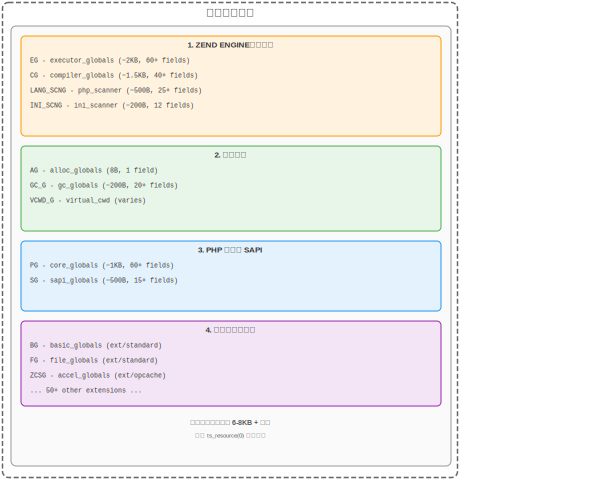
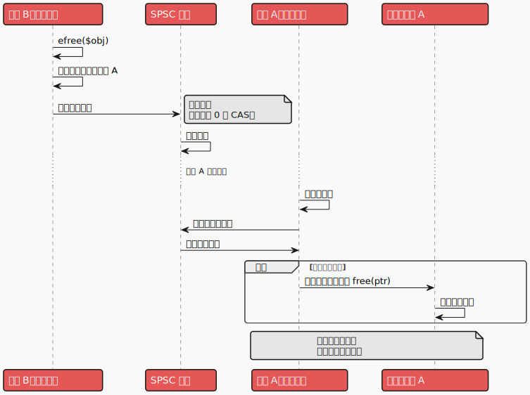
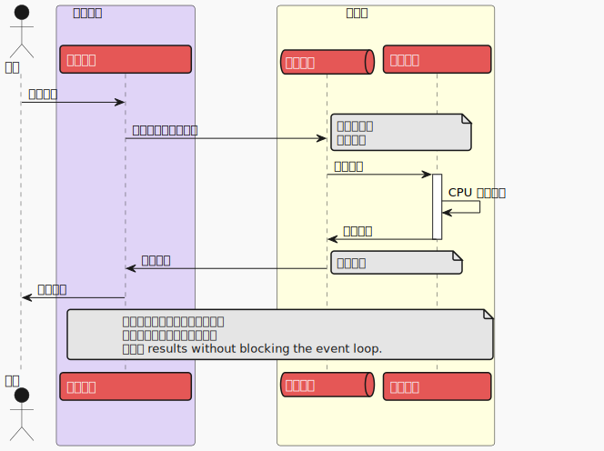
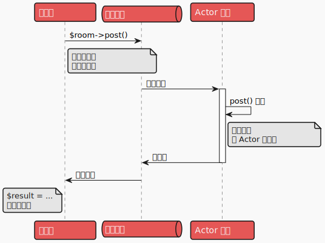

# PHP 的多线程：面向未来的视角

> 说明：文中的示意图/图片沿用现有版本，未单独本地化。

## 为什么写这篇文章？

在 [RFC TrueAsync 1.7](https://wiki.php.net/rfc/true_async) 的背景下，有个问题随之而来：提议的 RFC 将如何与 PHP 内核未来可能的变更互动？能够对 PHP 的未来方向有基本预判，是为未来多年设计好语言的关键。这正是本文存在的原因。

[TrueAsync](https://github.com/true-async/) 项目不仅是为异步而修改 PHP 内核，还包含其它研究，用来回答：

* PHP 在多线程方向能走多远？
* 是否存在根本性的限制？
* 要让多线程成为现实，内核可能需要哪些改动？
* 可以实现哪些语言抽象？

我没打算让本文覆盖多线程在 PHP 中的所有细节，也没打算让每一处都技术完备或人人易懂。但希望它能对大量 PHP 开发者有用，并为后续讨论定个大致方向。

## 历史

几年前，我们需要在 PHP 应用里加入大体量的遥测数据，我直说“不可能”。但看到 `Swoole` 的架构后，想亲自验证这个结论。能否构建一个既能产生、又能处理大量数据，同时不拖慢客户端交互的 API？

我们为 PHP 做了一个优化版的 `OpenTelemetry`：分片写入数据，把它们聚成大块发送到中间遥测服务器。数据会被压缩，`JSON` 结构通过 `MessagePack` 序列化。

核心假设是：如果用单线程的协程，就能逐步构建遥测数据，然后按定时或体积阈值定期发到服务器。代码应该很快，因为没有跨线程交互。真是这样吗？

实验结果是：遥测让 API 吞吐下降了一半。假设失败。为什么？在_概念_层面看起来都很合理。`Swoole` 已经让 PHP 函数非阻塞，协程按理应该高效。是哪儿出了错？

第二版中，遥测只在单个请求期间收集，然后立即丢进一个作业进程，负责聚合、压缩并发送到服务器。这个方案好得多。但理论上不该这样！还是应该这样？进程间的数据通过 `pipe` 传递，一边序列化，一边反序列化。即便 pipe 在内存里，系统调用也不便宜。

之后找到原因：遥测数据太多，压缩相对 API 处理耗费了大量 CPU。也就是说，`Swoole` 协程对 I/O 很有效，但对 CPU 密集任务帮不上忙。

这只是众多案例之一：单线程协程不是万能的；多线程可以补充协程，组成覆盖更广问题域的工具集。

## Single-threaded + offload

把 CPU 密集的工作丢到单独的进程，并不是“新发明”。它属于一种更通用的模型，在不同语言与框架中独立出现，被称为 **Single-threaded + offload**。

想象一个人飞快地分拣信件（每小时上千封），而沉重的包裹由其他员工装车运走。如果分拣员自己去搬包裹，会怎么样？信件队伍会堆到天花板。

`Single-threaded + offload` 把任务分成两类：

1. **I/O-bound 任务** —— 读文件、网络调用、数据库访问。大部分时间都在等待外部世界。成千上万此类操作可以通过并发异步（`协程`、`await`）塞进一个线程。

2. **CPU-bound 任务** —— 压缩、加密、解析、计算。这里 CPU 满负荷，仅靠并发不够，需要更多核心。

模型在**物理上**分隔这些任务：主线程（`Event Loop`）只管 `I/O`，`CPU` 任务发到单独的线程或进程（`Workers`）。

**Node.js** 以单线程 `Event Loop` 著称，适合网络应用。但当开发者试图在请求处理里做图像处理或视频压缩时，服务器会变成南瓜。解决方案是 `Worker Threads` —— 用独立线程处理 CPU 重任务。

**Python** 的路线类似。`asyncio` 为 I/O 代码提供了强力工具，但内置的 GIL（全局解释器锁）阻止了单进程内的真实 CPU 并行（写文时这一问题已被解决）。因此出现了 `loop.run_in_executor()` 和 `asyncio.to_thread()`（自 Python 3.9 起），把重活丢进线程池或进程池。Event loop 依然响应灵敏，计算在并行进行。

**PHP/Swoole** 架构也如此：`Request Workers` 用协程处理 HTTP 请求，`Task Workers` 做重计算。通过 `UnixSocket` 或 `pipe` 通信，一个进程可处理约 10 万次每秒。

### 模型的优点

**1. 资源利用高效**

单线程的事件循环能以极低开销处理成千上万并发 I/O 操作。协程之间切换比操作系统层面的线程上下文切换更便宜。`CPU-bound` 任务在多核上获得真实并行——每个 worker 占用自己的核心，不互相干扰。

**2. 开发更简单**

事件循环里的代码不需要互斥锁、信号量等多线程“乐趣”。单线程模型意味着任意时刻只有一个任务在跑，**数据竞争** 不存在。`Workers` 虽并行运行，但如果遵守 `Shared Nothing`，同步问题就不出现。

多线程代码与单线程异步代码的复杂度差距巨大。现代语言与框架都更倾向单线程异步，而非传统多线程，这并不奇怪。

**3. 编译器/运行时更简单**

单线程模型下的异步函数对编译器和运行时来说简单得多。一个支持多线程的好语言需要专门的代码生成流程。PHP 有个严峻限制：部分代码用 C 写成。这让基于线程的高效字节码优化、内存管理、参数传递都无法实现。Go 的设计为何复杂：自研栈、复杂 GC——都是为高效的 goroutine 与 channel 服务。我们稍后还会谈到 PHP 的 GC，先别放松！

**4. 手动分配负载**

开发者可以有意识地把负载在请求处理代码与 worker 池代码之间分配。手动控制能把硬件潜力榨到极限。但反过来也算缺点。

### 模型的缺点

**1. 手动分配负载**

手动分配是把双刃矛。开发者可能针对场景做优化，也可能误判哪些该在 I/O 代码，哪些该在 workers。结果是 I/O 代码被重活拖垮，响应性下降，延迟上升。

模型要求 PHP 程序员有足够的能力，或者依赖框架作者的成熟方案。

**2. 并非万能**

`Single-threaded + offload` 非常适合 Web 服务器、API、微服务——主要负载是对数据库、文件系统、网络的 I/O。但若每一步都需要重计算（科研计算、渲染、机器学习），此模型可能不够高效；完整的多线程更合适。

你可能说：这些都能接受！我们准备好了！但 PHP 自身准备好多线程了吗？

## PHP 准备好多线程了吗？

开发 `TrueAsync` 时，最难的讨论之一是“为什么 PHP 没有异步”。解释 PHP 为什么不适合多线程，可能同样棘手。不过先聊多线程：我们为什么需要它——或者更好地说：为什么我们**不**需要它？

> 多线程不是为了让代码并行执行。

“并行必须用多线程”这个想法很早就扎在程序员脑中，正如“黑洞会把东西吸进去”扎在大众认知一样。

并行执行由进程就能很好完成，而且互相隔离（从 80386 架构开始）。进程可以用 `IPC` 交互，完成与否由信号（操作系统事件）跟踪。那么为什么需要线程？

要诚实回答，得回到过去，请当时的决策者们来说明：Edsger Dijkstra、Fernando Corbató、Barbara Liskov、Richard Rashid……我们能办场很棒的访谈。但即便他们应邀，我们也未必能得到明确答案。

不太准确的说法是：

> 线程是为了让并行代码无需额外工具就能共享内存。

进程也可以共享内存，但需要把内存段映射进地址空间（额外工具）。线程默认共享**全部内存**。字面意义上，如果变量 `x` 在线程 `A` 可用，在线程 `B` 就能用同样地址访问，无需任何技巧……但并非如此！多个线程**不能**在不加工具的情况下安全操作同一个变量。

更诚实的说法是：

> 线程是为了在任务间传递内存而不增加额外开销。

如果线程在传递消息时使用内存，且保证任一时刻只有一个线程能访问特定内存区域，那么这在内存和 CPU 上都是最高效的。同时线程刻意避开那些会被共享的内存区。这种模型叫 `Shared Nothing`。

线程存在的意义，是在任务间高效传递数据。就像“黑洞不吸东西”一样真实。

## PHP 的内存模型

PHP 的内存如何工作？简化的抽象模型：
1. 代码
2. 数据
3. PHP VM 状态

共享 PHP 代码在多个线程之间已经可行（PHP JIT 出现时解决了这个问题）。其余部分紧密耦合，不能轻易拆开。例如 PHP 使用全局的 `object_store` 存储所有对象的引用。PHP 的内存管理器为了单个 PHP VM 设计，完全没面向多线程。PHP 的 **垃圾回收** 无法处理不同线程的数据，还要求完全停下 PHP VM，因为它直接修改对象的 `refcount`。

所以 PHP 是严格的单线程模型，GC 需要停世界。

### 在线程间移动 PHP VM

PHP 使用 **线程本地存储（TLS）** 按线程保存 VM 状态。这对 ZTS（Zend Thread Safety）模式下的线程隔离至关重要。

在现代 PHP 构建中，用 C11 标准的“静态”变量 `__thread`（MSVC 下是 `__declspec(thread)`）获取 VM 状态指针。这种操作极快，在 `x86_64` 上就是从 `FS` 或 `GS` 寄存器基址加偏移读地址。

```asm
      ; offset - 编译期计算的固定偏移
      ; fs - 段基址
      mov rax, QWORD PTR fs:offset
```

因为 `FS/GS` 由操作系统保证每个线程唯一，从中读取总能得到正确的 VM 状态指针。

能在线程间移动 VM 状态有助于实现类似 Go 的协程或 actor。现代 VM 通过定制代码生成，用 CPU 寄存器传递 VM 上下文。PHP 做不到这一点，因为底层是 C 函数，C 无法隐式把上下文参数传给所有函数。在线程间移动 PHP VM 状态，会带来一定的性能损耗。

但如果只移动执行代码所需的一小部分 VM 状态呢？例如 `PHP Fiber` 切换时会复制部分全局结构指针（`zend_executor_globals`）。

假设把 PHP VM 概念上拆成两大块：
1. `PHP VM` shared：类、函数、常量、ini 指令、可执行代码。
2. `PHP VM` movable：需要移动的那部分 VM。



部分结构可以标记为 `shared`，部分标记为 `movable`；甚至 `Executor Globals` 也可以拆分成 shared/movable，这样就能高效地在多线程间移动 VM 状态。扩展的全局结构不会因额外间接访问而掉性能，因为它们本就这么做。

问题在于与代码编译相关的结构，因为 PHP 具有 `include/require`、`eval`、自动加载等动态特性。正是这些特性使得高效地拆分 shared/movable VM 状态变得困难。若能解决这一点，PHP 就能以最小开销在线程间移动部分 VM 状态。

## 在线程间传递对象

要让 PHP 能安全在线程间传递对象，需要改什么？如何实现？

先从语言层面试试。假设我们有一个 `SomeObject` 实例在 `$obj` 里，需要把它送到另一个线程。这可能吗？

```php
$obj = new SomeObject();

$thread = new Thread(function () use ($obj) {
    echo $obj->someMethod();
});

$thread->join();
```

因为 `SomeObject` 只属于 `$obj`，我们可以安全地把它的地址从一个线程挪到另一个。主线程里的 `$obj` 会被销毁：

```php
$obj = new SomeObject();

$thread = new Thread(function () use ($obj) {
    echo $obj->someMethod();
});

// $obj is undefined here

$thread->join();
```

这与 C++ 新增的 move 语义、或 Rust 等语言里的 move 完全等价。这种在多线程间传递内存的方式有：
1. 安全性：仅一个线程拥有对象。
2. 无复制/序列化开销。

要让行为可预测并便于静态分析，可加上专门的移动语法，例如：

```php
$obj = new SomeObject();

// consume $obj 表示移动对象
$thread = new Thread(function () use (consume $obj) {
    echo $obj->someMethod();
});

// $obj is undefined here. Error should be reported here in PHP9.
echo $obj;
```

看起来很美，对吧？

然而，仅靠 `refcount = 1` 的移动会有问题。来看一个分类树：

```php
$electronics = new CategoryNode('Electronics');

$categoriesTree = new Tree();
$categoriesTree->addToPath('/products/electronics', $electronics);
$categoriesTree->addToPath('/popular/electronics', $electronics);  // 同一个分类！
```

`$electronics` 在树里出现两次（`refcount = 2`）。如果把 `$categoriesTree` 移到另一个线程，会怎样？

要安全移动，必须保证图中所有对象没有外部引用：

```php
$node = new CategoryNode('Electronics');
$categoriesTree = new Tree();
$categoriesTree->addToPath('/products/electronics', $node);

$favourites = [$node];  // 外部引用！

$thread = new Thread(function () use ($categoriesTree) {
    // $categoriesTree 已移动
});

// $favourites[0] 现在指向另一线程的内存
// Dangling pointer!
```

要保证安全移动，需要：

1. **完整遍历图** —— 检查所有子对象。
2. **检查 refcount** —— 图中每个对象都要查。
3. **保持身份** —— 图内的重复引用必须保持重复。

我们可以设计多个算法来做这件事，把它称为 `deep copy`。简单实现可能是：

```php
// Deep copy 伪代码
// 线程 A 中的源图
$node = new Node('A');        // addr: 0x1000
$tree->left = $node;          // addr: 0x1000
$tree->right = $node;         // addr: 0x1000 (同一引用)

// 拷贝到线程 B（带 MM 的伪代码）
$copied_map = [];  // hash table: addr_source -> addr_target

function deepCopyToThread(object $obj, Thread $target_thread_mm) 
{
    $source_addr = get_object_address($obj);

    if (isset($copied_map[$source_addr])) {
        return $copied_map[$source_addr];  // 已复制！
    }

    // 在目标线程的 MM 中分配内存
    $new_addr = $target_thread_mm->allocate(sizeof($obj));
    $copied_map[$source_addr] = $new_addr;

    // 复制对象数据
    memcpy($new_addr, $source_addr, sizeof($obj));

    // 递归遍历属性
    foreach ($obj->properties as $prop) {
        if (is_object($prop)) {
            $new_prop_addr = deepCopyToThread($prop, $target_thread_mm);
            // 更新新对象里的指针
            update_property($new_addr, $prop, $new_prop_addr);
        }
    }

    return $new_addr;
}

// 线程 B 中的结果：
// $newTree->left (addr: 0x2500) === $newTree->right (addr: 0x2500)
// 身份保持！
```

**Deep copy 的时间复杂度**：`O(N + E)`，其中 `N` 为对象数量，`E` 为引用数量。
**空间复杂度**：`O(N)` —— 哈希表 + 新对象 + 递归栈。

与序列化相比，这可能更快，因为省去转换传输格式的步骤，但收益取决于数据形状和图的大小。也可以做混合策略：`refcount = 1` 的数据直接移动，其余用 `deep copy`。

结果是：
1. PHP 开发者无需关心对象如何被送到其他线程。
2. 最佳情况：内存被移动（`refcount = 1`）。
3. 最差情况：用 `deep copy` 复制内存并保持身份（`refcount > 1`）。

看起来不错：
* PHP 语法改动最小。
* 变更可以逐步进行。
* 多线程可用。

但在内核层面并非一片光明。要让对象移动成真，PHP 需要跨线程的内存管理机制，目前尚不可行。

## 多线程版 PHP 内存管理器

PHP 的内存管理器类似现代分配器，如 `jemalloc` 或 `tcmalloc`。区别在于，它缺少从其他线程正确释放内存的算法。

场景：
* 对象在线程 `A` 创建。
* 通过移动（原样）传给线程 `B`。
* 在 `B` 不再需要，应被释放。

每个 PHP 线程都有自己的 `Memory Manager (MM)`。当 `B` 试图释放 `A` 分配的内存时，问题来了：`B` 的 MM 不认识 `A` 的内存，直接释放会出错。从 `B` 直接访问 `A` 的 MM 结构也不好，需要同步。现代高性能多线程分配器用延迟释放（deferred free）解决这个问题。

`deferred free` 的思路：
1. `B` 的 MM 发现一个不认识的指针。
2. 它找出该指针属于哪个 MM，向那个 MM 的队列发送“可释放”消息。
3. `A` 的 MM 处理队列，在自己的上下文中释放这些指针。



基于现代无锁结构，这个算法吞吐高，允许不同线程并行释放内存，几乎无需锁。

多线程版的 PHP 内存管理器，会为此前不可能的其它改动打开大门。

## 共享对象（Shared objects）

能在不同线程间以最小操作传递内存很棒，但如果我们能直接创建为共享而设计的对象呢？

很多服务可以做成不可变对象，这样就能在不同进程间共享，节省内存、加快 PHP worker 的启动。

可惜 `refcount` 成了阻碍，它实际上让所有 PHP 对象都变得可变！有没有办法绕过？

### 代理对象

一种方式是代理对象，指向存储在所有线程都可访问的共享内存池中的真实对象。代理只保存标识或指针以及访问真实对象数据的方法。缺点：
* 访问数据/属性的时间变长。
* `Reflection API` 与类型计算会更复杂。

好的一面是，PHP 已有成熟的代理机制。在某些场景，代理型共享对象是好选择，例如计数器表或类似 Swoole/Table 的数据表。

### 带 GC_SHARE 标志的共享对象

PHP 有 `GC_IMMUTABLE` 标志来支持**不可变**元素，使用于：

- **驻留字符串**（`IS_STR_INTERNED`）—— 整个进程生命周期内的字符串常量。
- **不可变数组**（`IS_ARRAY_IMMUTABLE`）—— 例如 `zend_empty_array`。
- **opcache 中的常量** —— 带常量数据的已编译代码。

`GC_IMMUTABLE` 让引擎可以**跳过**这些结构的 refcount 操作：

```c
// Zend/zend_types.h
// 增加 zend_refcounted_h 引用计数的函数
static zend_always_inline void zend_gc_try_addref(zend_refcounted_h *p) {
    if (!(p->u.type_info & GC_IMMUTABLE)) {
        ZEND_RC_MOD_CHECK(p);
        ++p->refcount;
    }
}
```

类似机制可用于 `SharedObjects`，例如定义一个 `GC_SHARE` 标志。

性能分析表明，检查 `GC_SHARE` 会让单独的 `refcount++` 多出 **+34% 开销**（微基准）。在真实应用里，refcount 操作只占小部分，总体影响应微乎其微：

- **贴近实际的操作**（数组/对象）：+3-9%
- **真实应用**：+0.05-0.5%

这解决了一半问题，另一半是为此类对象设计 GC。使用原子 refcount 不是好主意，多个线程频繁访问同一对象可能拖慢性能。延迟释放算法更可能适用。

### Region-based memory

面向 Web 的语言里，region-based memory 近来很流行。

思路是为特定任务或线程在独立的 region 中分配内存，当不再需要时可以整体（或几乎整体）释放，避免逐对象管理的复杂度，也简化 GC。

例如，`PHP MM` 可以保证在某个特定 region 中创建对象，并把该 region 绑定到某个 PHP 对象。region 的生命周期等于对象的生命周期。

当对象销毁时，整个 region 可以直接释放，无需遍历子元素。如果需要把这样的对象“移动”到另一线程，就能避免 deep copy。

PHP VM 在实现 region-based memory 时有难点，比如全局对象列表、opcode 缓存。但高效实现的可能性并非零，值得继续研究。

一个可用的 region-based memory 算法，为实现 actor（带隔离内存的特殊对象）打开了可能性。

Actor 是多线程编程里最方便、强大且安全的工具。

## 协程与线程的协同

对于协程而言，`Thread` 是一个 `Awaitable` 对象。协程可以等待 `Thread` 的结果，而不阻塞其他协程。也就是说，一个线程里可以有许多协程在等重任务的结果。处理这些协程的线程依旧能快速响应新请求，因为等待 `Thread` 不会阻塞事件循环。

```php
use Async\await;
use Async\Thread;

$thread = new Thread(function() {
    // hardware-bound task here
    return 42;
});

$result = await($thread); // 协程在此暂停，直到 Thread 完成
```

这种方式可以实现既有 CPU 密集任务，又有简单业务逻辑的聊天场景。



图中是示例架构：应用包含两个线程池——并发处理请求的线程池，以及处理 CPU 密集任务的 worker 池。协程处理一个请求时，可以完全暂停，等待 worker 完成重任务后再继续。

```php
use Async\await;
use Async\ThreadPool;

final readonly class ImageDto
{
    public function __construct(
    public int $width,
    public int $height,
    public string $text,
) {}
}

$pool = new ThreadPool(2);
$dto = new ImageDto(
    width: 200,
    height: 200,
    text: 'Hello TrueAsync!'
);

$image = $pool->enqueue(function (ImageDto $dto) {
    $img = imagecreatetruecolor($dto->width, $dto->height);

    $white = imagecolorallocate($img, 255, 255, 255);
    $black = imagecolorallocate($img, 0, 0, 0);

    imagefill($img, 0, 0, $white);
    imagestring($img, 5, 20, 90, $dto->text, $black);

    ob_start();
    imagepng($img);
    imagedestroy($img);
    return ob_get_clean();
}, $dto);

$response->setHeader('Content-Type', 'image/png');
$response->write($image);
$response->end();
```

协程代码是顺序的，看起来就像 `ThreadPool::enqueue` 在同一线程里调用回调一样。DTO 跨线程传递，生成的字符串也不会在内存中复制两次。

## 垃圾回收与 stateful 模式

升级 PHP 内存管理器只是改进多线程环境的一个方面。没有高效 GC，多线程 PHP 会因循环而出现性能问题和内存泄漏。

PHP 的 GC 使用两种算法：**引用计数** 作为主要的内存管理手段，**并发循环收集**（Bacon-Rajan，2001）用于循环引用。引用计数在每次赋值时增减，这在无同步的情况下无法安全用于多线程。每次赋值都用原子操作，开销巨大；不用同步又会产生竞争和泄漏。循环收集器虽然叫“并发”，却只在单线程内工作，使用颜色标记（**PURPLE** → **GREY** → **WHITE/BLACK**）找循环，这同样不是线程安全的。

好消息是，当前 GC 实现和内存管理器解耦，不依赖内存分配位置，因此在多线程环境中可以工作。

但如果 PHP 想进入 stateful 多线程时代，GC 需要适配来解决：
1. 能在单独线程 **并行** 工作，不影响业务代码。
2. 尽可能快地释放资源。
3. 提供额外工具来发现/记录内存泄漏、做遥测（对长时间运行的应用尤为重要！）。

循环收集器可以修改为在单独线程处理引用，提高整体响应性。作为开始，这可能已足够！

## Actor

`ThreadPool` 和跨线程传递对象很有用，但需要开发者投入注意力与经验。还有更好的抽象，能屏蔽线程与内存的复杂性，非常适合业务逻辑：**Actor**。

Actor 是并发并行编程模型，其中基本计算单元就是 **actor**。

每个 actor：
- 拥有自己的隔离状态。
- 顺序处理消息。
- 仅通过消息与其他 actor 交互。
- 可以在单独的线程中运行。

可以把 actor 看作对象，因此可在多线程 PHP 中沿用熟悉的 OOP 范式。

想象一个有众多房间的聊天服务器。每个房间是一个对象。

```php
use Async\Actor;

class ChatRoom extends Actor
{
    private array $messages = [];
    private string $name;

    public function __construct(string $name)
    {
        $this->name = $name;
    }

    public function postMessage(string $user, string $text): void
    {
        $this->messages[] = [
            'user' => $user,
            'text' => $text,
            'time' => time()
        ];
    }

    public function getMessages(): array
    {
        return $this->messages;
    }
}

spawn(function() {
   $room = new ChatRoom('general');
   $room->postMessage('Alice', 'Hello!');  // 在另一线程执行，会挂起协程！
   $messages = $room->getMessages();       // 在另一线程执行，会挂起协程！
   echo json_encode($messages);
});
```

`ChatRoom` 对象是特殊的：它们的数据与 PHP VM 状态被局部化，方便在线程间移动。每个方法都在独立线程中运行，但同一时刻只有一个线程能执行某个 actor 的方法。

从语义上看，基类 `Actor` 定义了 PHP VM 和内存管理器的工作方式，使 `ChatRoom` 可以安全地在独立线程中运行。类的类型不仅“存储”方法与属性的信息，还存储该类对象的内存管理与 GC 策略。类似的方法在其他语言（如 Rust、C++）中也存在。好处是无需修改语法，且自然符合现有 OOP 哲学。

示例看起来像在协程里运行的普通顺序代码。但因为 `postMessage` 和 `getMessages` 在另一个线程执行，并非直接运行。协程会向 actor 的队列发送**消息**，进入等待，只在 actor 在另一个线程执行完方法并返回结果时恢复。

这一切都不违背 PHP 常见的 OOP，因为 `Actor` 重写了 `__call`：

```php
class Actor 
{
    private $threadPool;

    public function __call(string $name, array $arguments): mixed
    {
        if(current_thread_id() === $this->threadPool->getThreadIdForActor($this)) {
            // 如果在同一线程，直接调用
            return $this->$name(...$arguments);
        }
    
        // 否则将调用加入 actor 队列
        return $this->threadPool->enqueueActorMethod($this, $name, $arguments);
    }
}
```

`enqueueActorMethod` 把 `postMessage` 放入 actor 队列，订阅结果事件，并调用 `Async\suspend()` 挂起协程。

Actor 的代码顺序执行，消除了数据竞争，让多线程开发对程序员透明。

并行性来自每个 `ChatRoom` actor 都能在不同线程运行：

```php
spawn(function() {
   $room = new ChatRoom('room1');
   $room->postMessage('Alice', 'Hello!');
   $messages = $room->getMessages();
   echo json_encode($messages);
});

spawn(function() {
   $room = new ChatRoom('room2');
   $room->postMessage('Bob', 'Hi there!');
   $messages = $room->getMessages();
   echo json_encode($messages);
});
```

不同的 `ChatRoom` 可以在不同线程并行运行，因为每个 actor 都有自己的执行线程、独立的 PHP VM 状态和内存。

创建 **100 个聊天室**：

```php
use Async\Actor;

$rooms = [
    'general' => new ChatRoom('general'),
    'random'  => new ChatRoom('random'),
    'tech'    => new ChatRoom('tech'),
    // ... 另外 97 个房间
];

// 处理请求的协程
HttpServer::onRequest(function(Request $request, Response $response) use ($rooms) {
   // 处理 HTTP 请求
   $roomName = $request->getQueryParam('room');
   $room = $rooms[$roomName] ?? null;
   
   if (!$room) {
      $response->setStatus(404);
      $response->write('Room not found');
      $response->end();
      return;
   }
   
   // 调用看似同步，实际在另一线程运行！
   $room->postMessage($request->getQueryParam('user'), $request->getQueryParam('text'));
   $messages = $room->getMessages();
   
   $response->setHeader('Content-Type',  'application/json');  
   $response->write(json_encode($messages));
   $response->end();
});
```

每个聊天室按顺序处理消息，同时与其他聊天室并行。

Actor 不需要互斥锁、阻塞、复杂同步或手动管理线程池。它们提供了现成的高级并行方案。

如果一个聊天室需要给另一个聊天室发消息，可以做到，因为 actor 是 `SharedObject`，可跨线程交互：

```php
class Rooms extends Actor
{
    private array $rooms = [];
    
    public function __construct(string ...$roomNames)
    {
       foreach ($roomNames as $name) {
           $this->rooms[$name] = new ChatRoom($name);
       }
    }
    
    public function broadcastMessage(string $fromRoom, string $user, string $text): void
    {
        foreach ($this->rooms as $name => $room) {
            if ($name !== $fromRoom) {
                // 非阻塞调用
                $room->postMessageAsync($user, $text);
            }
        }
    }
}

spawn(function() {
   $rooms = new Rooms('general', 'room1', 'room2', 'room3');
   $rooms->broadcastMessage('general', 'Alice', 'Hello!');
});

```        
    
### Actor 的内部

PHP VM 保证 actor 内的所有对象：
* 要么只属于该 actor，并分配在它的专有 region 中。
* 要么属于并被从其他 region 或线程移动过来。
* 要么是另一个 SharedObject 或其他 actor。

Actor 要么拥有自己的 region，要么仅与明确共享的不可变对象一起工作——否则仍会有竞争。

内存管理器保证 actor 方法中的所有内存操作都会自动绑定到与该 actor 直接关联的 region。

方法通过 `MPMC` 消息队列执行，由 `Scheduler` 负责。`Scheduler` 在 actor 之间分配 CPU 时间，提供并发和并行执行。



## 结语

这些听起来都很好，但何时能看到现实落地？你或许会问。

`Single-threaded + offload` 模型有望在不久后出现，因为许多组件已就绪。`TrueAsync`：单线程协程已到 Beta；实验版多线程内存管理器和创建线程的 `API` 已实现。

Actor 需要更多开发时间，它们涉及 PHP 内核的诸多部分，仍是 PHP 9 的现实目标，能为市场带来一个安全的多线程编程语言。
